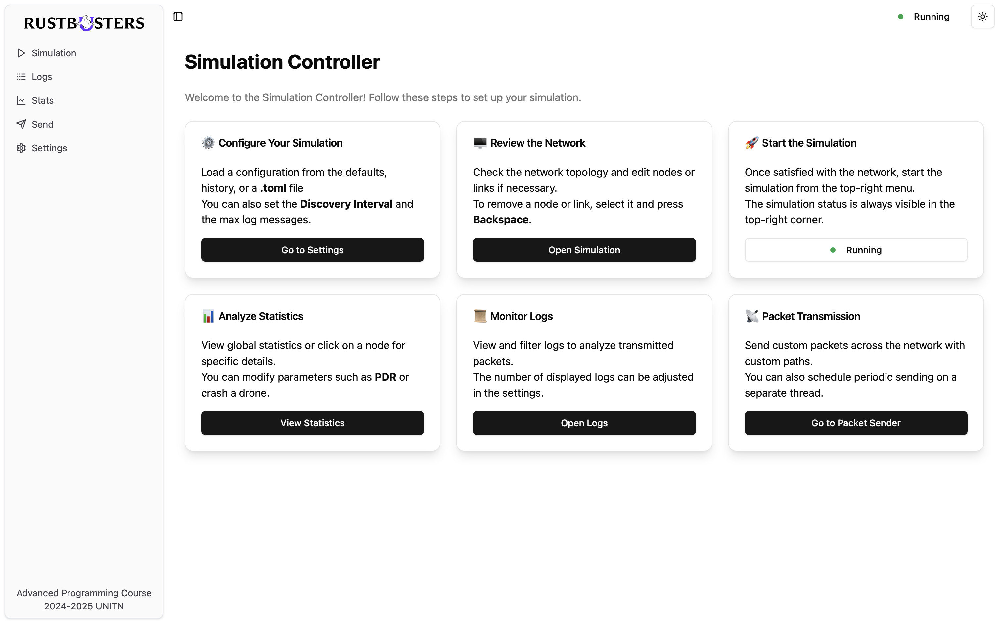
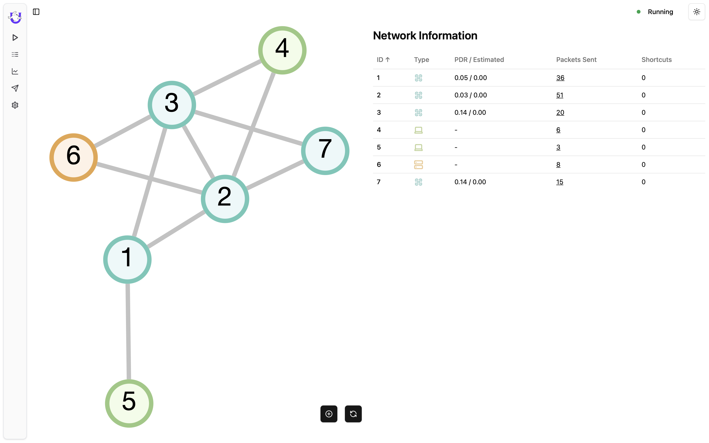
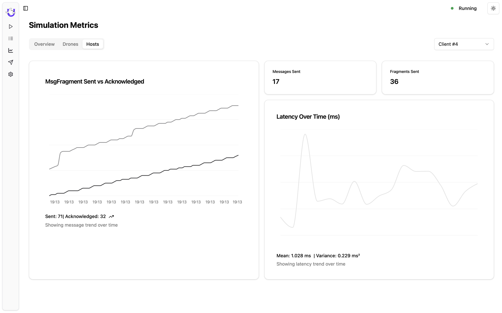
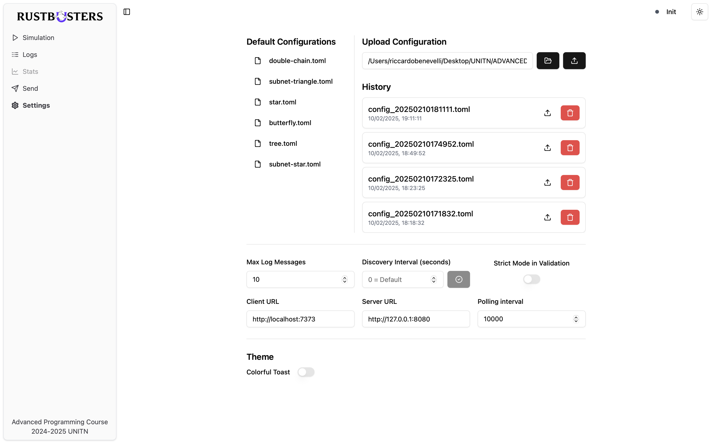

# **Drone Network Simulation Controller**

A university project for **Advanced Programming (2024-2025)** at the University of Trento, designed to manage and monitor a **simulated drone network**. This controller offers a **Rust + Tauri** backend and a **React (Tauri)** frontend for **real-time visualization**, **network controls**, and **statistical analysis**.


## **1. Introduction**

Welcome to the **Simulation Controller** — a tool that coordinates a network of **drones**, **clients**, and **servers** by:

- Loading and editing **network topologies** (via `.toml` files).
- **Sending and tracking** packets in real time.
- **Simulating disruptions** (e.g., crashed drones, adjustable Packet Drop Rate).
- **Analyzing** delivery metrics and logs.




## **2. Main Features**

### **2.1 Network Visualization & Management** :satellite:

- **Interactive Graph**
  - Observe the entire network as a node-link diagram.
  - Click to see details or edit neighbors and links.
  - Easily add or remove nodes and links with a few clicks.
- **Node Details Panel**
  - Quickly change PDR, add/remove neighbors, or **crash a drone**.
  - Real-time stats (packets sent, dropped) for each node.



### **2.2 Packet Handling & Monitoring** :package:

- **Live Logs**
  - A continuous stream of **packet events**—sent packets, flooding responses, etc.
  - Filter by node ID, type, or packet category for fast diagnostics.
- **Advanced Statistics**
  - **Simulation Metrics** like total packets sent, NACKs, or bytes transferred.
  - Detailed breakdowns (heatmaps, host vs. drone comparisons) for performance analysis.




### **2.4 Configuration & Settings** :wrench:

- **Load/Save Configurations**
  - Upload **`.toml`** files or choose from built-in templates (like _double-chain_ or _tree_).
  - Maintain a history of your configurations for quick rollback or comparison.
- **Global Parameters**
  - Set intervals for polling and discovery, define maximum logs, or enable Strict Mode.
  - Customize the UI theme or endpoint URLs to fit your environment.




## **3. How It Works**

1. **Initialization** :sparkles:

   - Select/upload a `.toml` file describing drones, clients, servers, and their links.
   - Configure simulation parameters (PDR, intervals, strict mode, etc.).
   - The welcome screen provides quick steps (e.g., “Go to Settings,” “Open Simulation”)

2. **Simulation Start** :rocket:

   - The **Rust** backend spawns simulation threads.
   - The UI displays the network graph and begins receiving updates in real time.

3. **Real-Time Interaction** :zap:

   - Observe packet flow, logs, and stats.
   - Crash drones or raise PDR to simulate failures.
   - Send custom packets to test network reliability.

4. **Data & Analysis** :chart_with_upwards_trend:

   - Use **Logs** to view hop-by-hop routing.
   - Inspect performance metrics in **Stats** for latency, throughput, or drop rates.

5. **Conclusion** :checkered_flag:
   - Pause or stop the simulation anytime.
   - Export logs, switch configurations, or re-run with different parameters.

---

## **4. Getting Started**

1. **Install Dependencies**
   ```bash
   bun install
   ```
2. **Run the Application**
   ```bash
   bun run tauri dev
   # or
   cargo tauri dev
   ```
3. **Explore the UI**
   - Load your chosen `.toml` in **Settings**.
   - Open **Simulation** to see the live network.
   - Start simulation using the **Play** button.
   - Check **Logs** for packet events, use **Stats** for in-depth analysis, or head to **Send** to create custom packets.
